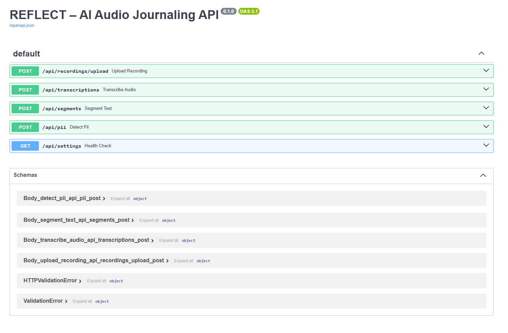

# Installation steps

## Environment Setup (macOS & Windows)

Follow these steps to set up a local Python environment for the REFLECT backend.

---
### Prerequisites
- Python 3.10
- `pip` (comes with Python)

Check your versions:
```bash
python --version
pip --version
```

### Clone the repository
Clone the repo from git and go into the backend directory.
```bash
git clone https://github.com/imanmossavat/Reflect_Audio_Journaling.git
cd Backend
```

### Create a virtual environment

#### Windows

###### Command Prompt (CMD)
```bash
python -m venv .venv
.venv\Scripts\Activate
```

###### PowerShell
```bash
python -m venv .venv
.\.venv\Scripts\Activate.ps1
```

#### macOS/Linux
```bash
python3 -m venv .venv
source .venv/bin/activate
```

## Installation
```bash
pip install --upgrade pip
pip install -r requirements.txt
```

### Starting the application
Run the command below and wait for application startup to finish:
```bash
uvicorn app.main:app --reload
```

## Using the application
Then visit http://localhost:8000/docs, it is possible that you already have something running on port 8000,
in that case you can specify another port with the `--port` flag, e.g. `--port 8001`. Or just let the application choose its own port.
In that case wait for the application to start up and copy the URL from the terminal.

Once you have done this you can use the interactive API documentation to try out the endpoints.

---
You can do so by clicking on the endpoint you want to try out, then click on the "Try it out" button. It also tells you what parameters it expects, so for this endpoint you need to provide text in the request body.

---
After you click on try it out you can provide the text you want to analyze, then click on the "Execute" button.

---
Then the response will appear below with the analyzed text.

---

- Project: REFLECT – AI Audio Journaling System

---